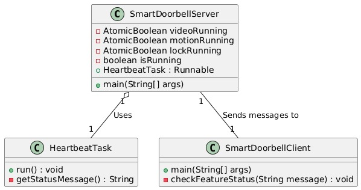
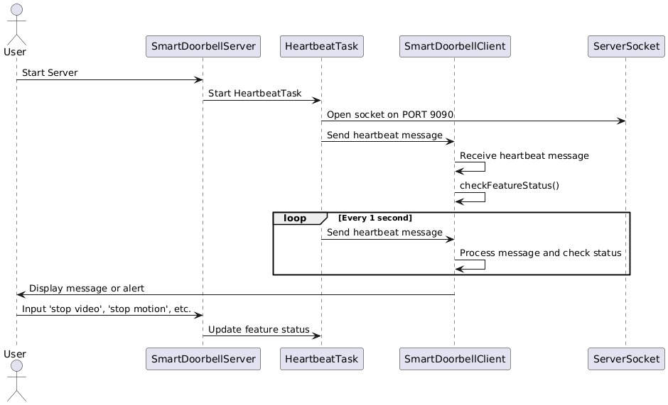

# Smart Doorbell

## Overview:
The Smart Doorbell system is designed to monitor three critical features: **video recording, motion detection,** and **lock control**. These features are continuously monitored for failures using a heartbeat mechanism. The system employs active redundancy, meaning both primary and secondary servers operate simultaneously to ensure high availability and fault tolerance.

## Key Features:
+ Non-deterministic failure simulation.
+ Heartbeat monitoring to detect crashes of the critical features.
+ Client alerts when any feature stops functioning.
+ Active Redundancy ensuring seamless operation and minimal downtime during failures.

## Class Diagram

## Sequence Diagram

## What exactly the program does
The program mimics a real-world smart doorbell system that requires continuous operation of critical features such as video recording, motion detection, and lock control. These features are essential for the functioning of a smart doorbell in scenarios like security and remote access management.
1. Server Initialization - The server initializes both primary and secondary roles, ensuring dynamic role management. This simplifies role management and ensures that both roles are operational and ready to switch dynamically when required.
2. Heartbeat Mechanism - Heartbeat Messages is sent every second, these messages indicate the status of each feature, allowing for quick failure detection. Messages are broadcast to connected clients, ensuring real-time updates on feature functionality.
3. Client Monitoring: The client connects to the server and listens for heartbeat messages. If a feature stops, the client raises an immediate alert, keeping users informed of any issues.
4. Failure Simulation: The system doesn't just simulate predictable failures; it introduces random crashes to replicate how failures might occur in real-world scenarios. Features can be stopped either randomly or by user command, simulating system failures.
5. Fault Recovery and Role Switching: With active redundancy in place, both the primary and secondary servers run concurrently. If the primary server fails, the secondary server automatically takes over, ensuring continued operation. This setup minimizes downtime, allowing the system to function without interruption.
6. Monitoring and System Recovery: Any failure in the system is immediately detected by the client, which raises an alert. This real-time notification mechanism ensures that users are informed instantly when something goes wrong, allowing them to respond quickly.

## How to Run:
### Server Setup:
1. Compile and run the SmartDoorbellServer.java.
2. This will start a server that continuously monitors the status of video recording, motion detection, and lock control features.
3. To stop a feature, input commands like
    - `stop video`
    - `stop motion`
    - `stop lock`
  
The feature will be marked as stopped, and the heartbeat message will reflect this change.

### Client Setup:
1. Compile and run the SmartDoorbellClient.java.
2. The client will connect to the server and listen for heartbeat messages.
3. The client will print the status of the features and raise an alert if any feature has stopped.

## Commands:
+ stop video – Simulate video recording feature crash.
+ stop motion – Simulate motion detection feature crash.
+ stop lock – Simulate lock control feature crash.
+ exit – Shut down the server.

## Dependencies:
+ Java 8 or later
+ No external libraries required

## Note:
+ The server and client should be run on the same machine, or the host address in SmartDoorbellClient should be updated accordingly.
+ The server sends heartbeat messages every second, which the client receives and processes in real time.

## Failure Simulation:
+ Each feature can be stopped by the user, simulating non-deterministic failures.
+ The client detects these failures by processing the heartbeat messages and raises an alert when a failure is detected.

## AI Generated Code:
This project utilizes an AI generated code for the initial structure of the code, enhancing productivity and ensuring consistency across the codebase.
